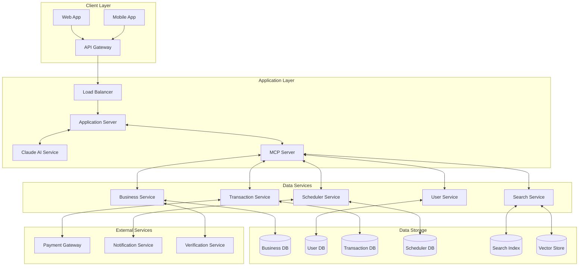

# Local Search & Action Platform Architecture

Here's a comprehensive architecture for your local search platform that enables conversational search and transaction completion:

## Core Components

### 1. Client Layer

- **Web & Mobile Applications**: User-facing interfaces for the conversational search experience
- **API Gateway**: Manages authentication, rate limiting, and routes requests

### 2. Application Layer

- **Application Server**: Handles user sessions and orchestrates the various services
- **Claude AI Service**: Integrates with Anthropic's API to power the conversational interface
- **MCP Server**: The bridge between Claude and your data services

### 3. Data Services

- **Business Service**: Manages business listings, profiles, services, and pricing
- **User Service**: Handles user accounts, preferences, and location data
- **Transaction Service**: Processes bookings, appointments, and payments
- **Scheduler Service**: Manages availability and scheduling logic
- **Search Service**: Powers both semantic and structured search capabilities

### 4. Data Storage

- **Business DB**: Stores business details, services, and credentials
- **User DB**: Stores user profiles and preferences
- **Transaction DB**: Records of all bookings and payments
- **Scheduler DB**: Availability calendars and booking slots
- **Search Index & Vector Store**: For efficient text and semantic search

### 5. External Services

- **Payment Gateway**: For processing payments (Stripe, PayPal, etc.)
- **Notification Service**: For SMS/email confirmations and reminders
- **Verification Service**: For business verification and quality control

## Key Workflows

### Search & Discovery Flow

1. User query enters through client app
2. Claude interprets intent via MCP
3. MCP queries relevant data services
4. Results are formatted by Claude and presented to user

### Booking Flow

1. User selects a business and requests appointment
2. MCP checks availability through Scheduler Service
3. User confirms booking details
4. Transaction Service processes payment if needed
5. Scheduler Service confirms appointment
6. Notification Service alerts both user and business

This architecture provides the flexibility to start with core features and gradually expand into more complex transactions and deeper integrations with local businesses.
