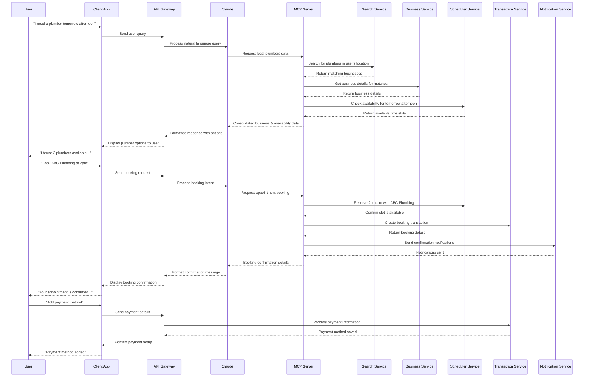

# Sequence Diagram for Local Search & Action Platform

I've created a sequence diagram showing the flow of information between system components for two main user journeys:

## Main Sequences

### 1. Search and Discovery Sequence

This flow shows what happens when a user asks for a service:

1. User submits a natural language query ("I need a plumber tomorrow afternoon")
2. The query passes through the client app to Claude via the API gateway
3. Claude analyzes the intent and requests relevant data through the MCP server
4. MCP coordinates with multiple services:
   - Search Service to find relevant businesses
   - Business Service to get detailed information
   - Scheduler Service to check availability
5. Results flow back to Claude, which formats them conversationally
6. The user receives a natural language response with options

### 2. Booking Sequence

This flow shows the transaction process:

1. User selects a business and time slot
2. Claude interprets this as a booking intent
3. MCP server coordinates:
   - Scheduler Service to reserve the time slot
   - Transaction Service to create a booking record
   - Notification Service to alert all parties
4. Confirmation flows back to the user

### 3. Payment Processing (Optional)

A supplementary flow for handling payments:

1. User provides payment information
2. Transaction Service securely stores payment method
3. User receives confirmation

## Key Interactions

The diagram highlights several important system characteristics:

1. **Claude as the Conversation Manager**: Claude interprets user intent and formats responses, but delegates data operations to the MCP server
2. **MCP as the Orchestrator**: The MCP server coordinates between multiple services rather than Claude directly accessing each service
3. **Service Independence**: Each service has a specific responsibility, making the system modular and maintainable
4. **Bidirectional Flow**: Information flows both ways through the system, with each component transforming data appropriately for the next

This sequence flow represents a complete conversation from search to booking confirmation, showing how the various architectural components work together to deliver a seamless user experience.

## How to handle the variability in how users express their needs. It's indeed one of the hardest problems in search that even Google continues to refine. Here's how your platform with Claude can address this challenge:

## How Claude Handles Varied Service Requests

1. **Natural Language Understanding**
   Claude has strong semantic understanding capabilities that allow it to recognize that "fix leaky pipe," "person for leakage," and "plumber" all refer to similar service needs. This is fundamentally different from keyword matching that traditional search engines rely on.
2. **Service Taxonomy & Mappings**
   Your MCP server should maintain a rich taxonomy of services with: - Primary service categories (plumbing, HVAC, electrical, etc.) - Common tasks within each category (fix leaks, install fixtures) - Alternative terms and phrases ("AC technician" = "air conditioning repair") - Regional language variations
3. **Clarification Through Conversation**
   Unlike traditional search where a bad query means bad results: - Claude can ask clarifying questions: "It sounds like you need help with a leaking pipe. Is that correct?" - Users can correct misunderstandings in natural conversation - The system learns from these interactions

## Implementation Approach

Here's how to build this into your platform:

1. **Service Classification Model**
   - Train Claude (via prompt engineering) to map user requests to your service taxonomy
   - Your MCP can include a specific endpoint like `classifyServiceRequest` that translates natural language to structured service categories
2. **Synonym Expansion**
   - In your search service, implement synonym expansion for service terms
   - For example, "AC technician," "air conditioning repair," and "cooling system specialist" should all map to the same service category
3. **Contextual Understanding**
   - Use conversation history to build context
   - If a user previously mentioned a bathroom, a subsequent mention of "leakage" is more likely plumbing-related
4. **User Feedback Loop**
   - Track which businesses users ultimately engage with after various queries
   - Use this data to improve your service mappings
   - Capture explicit corrections (user says "No, I meant window AC unit, not central air")
5. **Location-Specific Language**
   - Different regions use different terms for the same services
   - Build regional variations into your service taxonomy

The key advantage your platform has over traditional search engines is the conversational nature - Claude doesn't have to get it right on the first try. It can engage in a quick clarification dialogue that feels natural to users while ensuring they get exactly what they need.

This approach combines the best of AI language understanding with structured data in a way that traditional search engines can't match, creating a more intuitive and effective user experience.
