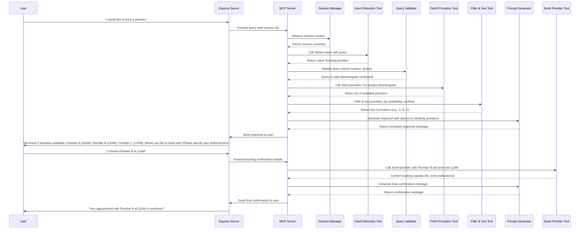

# Sequence Diagram for Local Search & Action Platform

### Detailed Explanation of Each Component and Step

#### **1. User Initiates the Process**

- **User (U):**  
  The conversation starts when a user sends a message like,  
  _"I would like to book a plumber."_  
  This is the initial request from the customer.

#### **2. Express Server Receives the Request**

- **Express Server (E):**  
  Acts as the entry point for all user messages. It receives the query along with a session ID (a unique identifier for the ongoing conversation) and forwards it to the MCP Server.

#### **3. Session Context Management**

- **MCP Server (S) → Session Manager (SD):**  
  Before processing the query, the MCP Server asks the Session Manager to retrieve the session context.
  - **Session Manager (SD):**  
    Maintains a brief summary of the conversation so far (without sending the entire history each time). This summary might include key details such as location or previous choices.
- **Session Manager → MCP Server:**  
  Returns a summary of the session that will help provide context for the current query.

#### **4. Intent Detection**

- **MCP Server (S) → Intent Detection Tool (ID):**  
  The system calls the `detect-intent` tool with the user's query.
  - **Intent Detection Tool (ID):**  
    Analyzes the text of the query (using embeddings or custom logic) to determine what the user wants to do. In this case, it recognizes the intent as "booking:plumber."
- **Intent Detection Tool → MCP Server:**  
  Returns the detected intent.

#### **5. Query Validation**

- **MCP Server (S) → Query Validator (DV):**  
  The system then validates the query by checking factors like correct location (Beeramguda) and syntax.
  - **Query Validator (DV):**  
    Confirms that the request is applicable and matches your service area.
- **Query Validator → MCP Server:**  
  Returns a validation response, confirming the query is valid (e.g., “Beeramguda confirmed”).

#### **6. Data Retrieval – Fetching Providers**

- **MCP Server (S) → Fetch Providers Tool (FP):**  
  With a valid query and the confirmed location, the MCP Server calls the `fetch-providers` tool to retrieve a list of plumbers in Beeramguda from your database.
  - **Fetch Providers Tool (FP):**  
    Interacts with the database and returns a raw list of plumbers available in the area.
- **Fetch Providers Tool → MCP Server:**  
  Returns the list of available plumbers.

#### **7. Filtering & Sorting the Results**

- **MCP Server (S) → Filter & Sort Tool (FS):**  
  The raw list might be too large or unorganized. The system then calls the `filter-and-sort` tool.
  - **Filter & Sort Tool (FS):**  
    Filters out providers without available slots and sorts the remaining ones based on criteria like review ratings.
- **Filter & Sort Tool → MCP Server:**  
  Returns the top 3 providers (e.g., Plumber A, B, and C) along with details such as available time slots.

#### **8. Generating a Response for the User**

- **MCP Server (S) → Prompt Generator (PR):**  
  The MCP Server calls the `format-response` prompt to generate a natural language message that summarizes the options and asks a clarifying question.
  - **Prompt Generator (PR):**  
    Uses an LLM (like GPT-4o-mini) to convert the technical data into a friendly message.  
    For example:  
    _"We found 3 plumbers available: Plumber A (10AM), Plumber B (11AM), Plumber C (12PM). Would you like to book one? Please specify your preferred time."_
- **Prompt Generator → MCP Server:**  
  Returns the formatted message.

#### **9. Sending the Options to the User**

- **MCP Server (S) → Express Server (E):**  
  The MCP Server sends the formatted response back to the Express Server.
- **Express Server (E) → User (U):**  
  The Express Server relays the message to the user.

#### **10. User Makes a Selection**

- **User (U):**  
  The user responds with their choice, e.g., _"I choose Plumber B at 11AM."_
- **Express Server (E):**  
  Forwards the booking confirmation details back to the MCP Server.

#### **11. Finalizing the Booking**

- **MCP Server (S) → Book Provider Tool (BP):**  
  The MCP Server now calls the `book-provider` tool with the selected provider (Plumber B) and the chosen time slot (11AM).
  - **Book Provider Tool (BP):**  
    Updates the database to reserve the time slot, and may also trigger notifications (e.g., to the plumber and the user).
- **Book Provider Tool → MCP Server:**  
  Returns a confirmation that the booking is complete.

#### **12. Confirming the Booking with the User**

- **MCP Server (S) → Prompt Generator (PR):**  
  Calls the `confirm-booking-response` prompt to generate a final confirmation message.
  - **Prompt Generator (PR):**  
    Formats a message like, _"Your appointment with Plumber B at 11AM is confirmed."_
- **Prompt Generator → MCP Server:**  
  Returns the confirmation message.
- **MCP Server (S) → Express Server (E):**  
  Sends the final message to the Express Server.
- **Express Server (E) → User (U):**  
  The final confirmation is delivered to the user.

---

### Explaining to Non-Technical Staff

Imagine you’re running a service desk:

1. **A Customer’s Request:**  
   A customer calls in and says, _"I need to book a plumber."_
2. **Reception Desk (Express Server):**  
   The receptionist takes note of the call and sends the request along with the customer’s details (session ID) to a specialized team (MCP Server).

3. **Checking Past Interactions (Session Manager):**  
   The team checks the customer’s previous interactions to quickly understand the context without having to review all past conversations.

4. **Understanding the Request (Intent Detection):**  
   The team analyzes the request and determines that the customer wants to book a plumber.

5. **Validating the Request (Query Validator):**  
   The team confirms that the request is valid and that it applies to the correct location (Beeramguda).

6. **Finding Available Plumbers (Fetch Providers):**  
   The team then looks up a list of available plumbers in Beeramguda from their records.

7. **Refining the List (Filter & Sort):**  
   They filter the list to show only those who are available and rank them based on quality (reviews, available time slots).

8. **Offering Choices (Prompt Generator):**  
   The team prepares a friendly message for the customer, saying something like:  
   _"We found 3 plumbers available: Plumber A at 10AM, Plumber B at 11AM, and Plumber C at 12PM. Which one would you like to book?"_

9. **Customer Chooses:**  
   The customer selects Plumber B at 11AM.

10. **Final Booking (Book Provider):**  
    The team then finalizes the booking by updating their schedule and sends a confirmation back to the customer:  
    _"Your appointment with Plumber B at 11AM is confirmed."_

Each step is handled by a specific part of the system, ensuring that the conversation is efficient, context is maintained, and the right actions are taken without burdening the customer with too much information.

---

This detailed breakdown and diagram illustrate how your system efficiently manages everything—from understanding the request to confirming the booking—using a modular, step-by-step process that minimizes unnecessary data transfer while still providing a smooth, human-like conversation.
